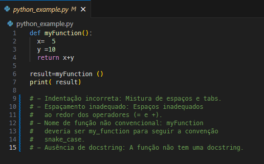
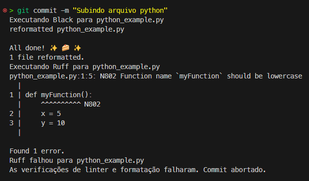
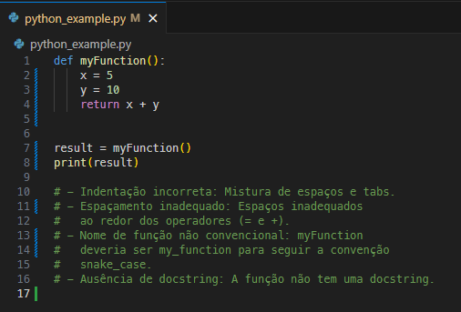
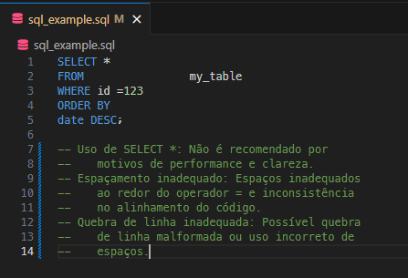
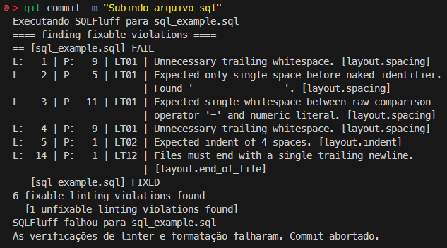
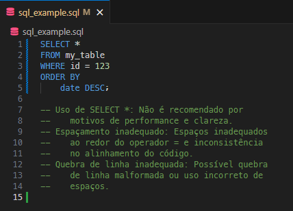

# Projeto de Linting e Formatação de Código

Este projeto é uma configuração de exemplo que demonstra como configurar e utilizar linters (ferramentas de validação de código) e ferramentas de formatação para Python, SQL e YAML utilizando Docker. O objetivo é garantir que o código siga padrões de estilo consistentes e que erros comuns sejam detectados automaticamente antes de serem comitados.

## Estrutura do Projeto

```plaintext
├── Dockerfile
├── README.md
├── pre-commit.example
├── python_example.py
├── sql_example.sql
└── yaml_example.yaml
```

## Descrição do Projeto

Este projeto contém exemplos de arquivos Python, SQL e YAML intencionalmente mal escritos e que serão verificados e formatados automaticamente usando ferramentas específicas para cada linguagem.
O Dockerfile incluído permite que todo o processo seja executado em um ambiente isolado e consistente.

### Ferramentas Utilizadas

-  **[Ruff](https://github.com/astral-sh/ruff)**: Linter para código Python, capaz de detectar e corrigir problemas de estilo e possíveis erros de código.
-  **[Black](https://github.com/psf/black)**: Ferramenta de formatação para Python que garante que o código siga um estilo consistente.
-  **[SQLFluff](https://github.com/sqlfluff/sqlfluff)**: Linter e formatador para SQL, compatível com diferentes dialetos, incluindo Redshift.
-  **[Yamllint](https://github.com/adrienverge/yamllint)**: Linter para YAML, que verifica problemas de sintaxe e formatação.

## Configuração Inicial

### 1. Preparação do Pre-commit Hook
Para configurar o pre-commit hook que executará automaticamente as ferramentas de linting e formatação antes de cada commit, siga os passos abaixo:

1. Copie o arquivo `pre-commit.example` para o diretório `.git/hooks/` com o nome `pre-commit`:

```bash
cp pre-commit.example .git/hooks/pre-commit
```

2. Torne o arquivo executável:

```bash
chmod +x .git/hooks/pre-commit
```

### 2. Build da Imagem Docker
Para configurar o ambiente Dockerizado com todas as ferramentas necessárias, construa a imagem Docker utilizando o Dockerfile fornecido:

```bash
docker  build  -t  my-linter-image  .
```

### 3. Executando as Ferramentas de Linting e Formatação

Após configurar o pre-commit hook, toda vez que você tentar realizar um commit, as ferramentas de linting e formatação serão executadas automaticamente para garantir que o código esteja de acordo com os padrões estabelecidos.

## Arquivos de Configuração

O projeto inclui três arquivos de configuração que controlam o comportamento dos linters e formatadores:

-  **`.ruff.toml`**: Configuração do Ruff para Python.
-  **`.sqlfluff`**: Configuração do SQLFluff para SQL.
-  **`.yamllint`**: Configuração do Yamllint para YAML.

Estes arquivos estão configurados com parâmetros básicos para trabalhar com este projeto modelo mas podem ser ajustados conforme necessário (consulte as documentações das bibliotecas para customizar conforme o seu gosto).

## Como Funciona

-  **Linting**: Ao tentar realizar um commit, as ferramentas de linting verificam o código para garantir que ele segue os padrões estabelecidos.

-  **Formatação**: Se forem encontrados problemas de formatação, as ferramentas tentarão corrigi-los automaticamente. Se não for possível, o commit será abortado até que os problemas sejam resolvidos.

-  **Linha em Branco no Final dos Arquivos**: O pre-commit hook garante que todos os arquivos tenham uma linha em branco ao final, conforme as melhores práticas.

## Demonstração:

### Python

1.Antes da verificação:<br>


2.Mensagens do linter:<br>


3.Após a formatação:<br>

<br>
### SQL

1.Antes da verificação:<br>


2.Mensagens do linter:<br>


3.Após a formatação:<br>
